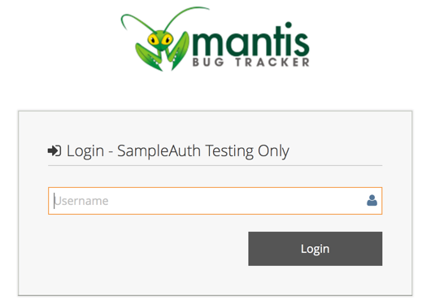

# SampleAuth Plugin

This is a sample authentication plugin showing how a MantisBT authentication plugin can implement its own login flow and control authentication related flags.

The authentication mechanism implemented by this plugin just takes a username and logs the user without needing a password.  The plugin also disables ability for user to manipulate their password or login via standard MantisBT login page.

The plugin can be easily modified to redirect to an identity provider and validate the token returned or validate a username and password against a database or LDAP.

## Authentication Flags
The authentication flags events enables the plugin to control MantisBT core authentication behavior and provide its own authentication pages.

- `signup_enabled` - enable signups (ON/OFF).
- `signup_access_level` - access level to assign for users who signup.
- `anonymous_enabled` - enable anonymous login (ON/OFF)
- `anonymous_account` - anonymous account name. Only applicable when `anonymous_enabled` is set to ON.
- `access_level_set_password` minimum access level to set password in MantisBT database or NOBODY to disable.
- `password_managed_elsewhere_message` message to show in MantisBT UI to indicate that password is managed externally.  If left blank or not set, the default message will be used.
- `password_change_not_allowed_message` message to show indicating to user that they can’t edit their password.  If left blank or not set, the default messages will be used.
- `access_level_create_api_tokens` Access level required to set API tokens.
- `access_level_can_use_standard_login` Access level required use standard login.  Should be set to ANYBODY if signed up or anonymous access is supported.  Otherwise, can be set to ADMINISTRATOR or some access level.
- `login_page` Custom login page to use.
- `logout_page` Custom logout page to use.
- `logout_redirect_page` Page to redirect to after user is logged out.
- `session_lifetime` Default session lifetime in seconds or 0 for browser session.
- `perm_session_enabled` Flag indicating whether remember me functionality is enabled (ON/OFF).
- `perm_session_lifetime` Lifetime of session when user selected the remember me option.
- `reauthentication_enabled` A flag indicating whether reauthentication is enabled (ON/OFF).
- `reauthentication_expiry` The timeout to require re-authentication.  This is only applicable if `reauthentication_enabled` is set to ON.

If a flag is not returned by the plugin, the default value will be used based on MantisBT core configuration.

## Screenshots

Login Page

User My Account Page

## Dependencies
MantisBT v2.3.0-dev once auth plugin support is added.
